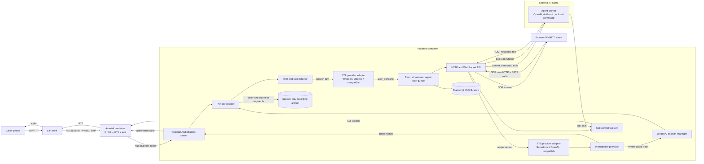

# FlowHunt Voicebot

Prototype SIP voicebot runtime for receiving calls through Asterisk, converting
caller audio to text, sending text events to an external AI agent, and playing
the agent response back into the call.

The first implementation is intentionally modular. The SIP transport, VAD/turn
detection, STT, AI-agent API, TTS, playback, transcripts, and Asterisk control
are separate Python modules so each part can be replaced later.

## How It Works

FlowHunt Voicebot behaves like a SIP phone backed by an event-driven AI runtime.
Asterisk owns the SIP registration, incoming call signaling, RTP media, and
low-level call control. The Python voicebot service receives raw call audio from
Asterisk over AudioSocket, detects caller speech, converts turns to text, emits
events for an external AI agent, accepts asynchronous responses, converts those
responses to speech, and streams the generated audio back into the same call.

The runtime is split into replaceable parts:

- **SIP and media transport**: Asterisk registers to the SIP trunk with PJSIP,
  answers incoming calls, and bridges call audio to the Python service through
  AudioSocket.
- **Call session manager**: `voicebot` creates one isolated session per call.
  Parallel incoming calls are handled as separate sessions with separate event
  queues, playback state, transcripts, and call-control state.
- **Turn detection and barge-in**: VAD watches inbound audio continuously. When
  the caller starts speaking, current bot playback is interrupted so the caller
  can take the turn immediately.
- **STT pipeline**: the configured speech-to-text provider receives completed
  speech turns and returns recognized text. The default local provider is
  Whisper; OpenAI and compatible providers can be selected through environment
  variables.
- **Event queue and transcript store**: every call lifecycle event, speech
  event, transcript, agent request, playback event, tool request, and control
  result is appended to the in-memory event stream and persisted as JSONL under
  the transcript directory.
- **AI agent boundary**: the voicebot core does not contain business logic. It
  exposes pending tasks and tools over HTTP so an external agent can decide what
  to say or what call action to perform.
- **TTS and playback pipeline**: agent text responses are synthesized by the
  configured TTS provider and played back into the SIP call. Playback is
  interruptible whenever the caller starts speaking.
- **Speech-only call recording**: completed calls can publish a playable WAV
  recording that concatenates caller and voicebot speech segments while omitting
  silence. Segment metadata keeps the original call offsets for audit and
  diagnostics.
- **Asterisk control tools**: the agent can ask the runtime to hang up,
  transfer the call, send DTMF, stop playback, or read call transcripts through
  HTTP tool endpoints.

The canonical execution model and frame taxonomy used for the next architecture
iteration are documented in [docs/EXECUTION_MODEL.md](docs/EXECUTION_MODEL.md).
The first shared realtime audio turn-detection primitive is documented in
[docs/REALTIME_AUDIO.md](docs/REALTIME_AUDIO.md).
The transport/media contract for SIP, WebRTC, and future call providers is
documented in [docs/TRANSPORTS.md](docs/TRANSPORTS.md).
The provider capability model is documented in
[docs/PROVIDERS.md](docs/PROVIDERS.md).
Conversation flow definitions for freeform and structured voicebots are
documented in [docs/CONVERSATION_FLOWS.md](docs/CONVERSATION_FLOWS.md).
The generic subagent/external task framework is documented in
[docs/SUBAGENTS.md](docs/SUBAGENTS.md).
Async task lifecycle, polling, and durable provider task references are
documented in [docs/TASK_LIFECYCLE.md](docs/TASK_LIFECYCLE.md).
Durable event/task/transcript state contracts are documented in
[docs/DURABLE_STATE.md](docs/DURABLE_STATE.md).
Observability, tracing, timeline, and regression evaluation primitives are
documented in [docs/OBSERVABILITY.md](docs/OBSERVABILITY.md).
Horizontal scaling and worker deployment topology are documented in
[docs/SCALING.md](docs/SCALING.md).
Local-to-Kubernetes deployment role parity is documented in
[docs/DEPLOYMENT_TOPOLOGY.md](docs/DEPLOYMENT_TOPOLOGY.md).
The internal operations dashboard is documented in
[docs/DASHBOARD.md](docs/DASHBOARD.md).
The embeddable public WebRTC widget is documented in
[docs/VOICEBOT_WIDGET.md](docs/VOICEBOT_WIDGET.md).
Production operations, ingress, and onboarding runbooks are documented in
[docs/PRODUCTION_RUNBOOK.md](docs/PRODUCTION_RUNBOOK.md).
Multimodal extension points are documented in
[docs/MULTIMODAL.md](docs/MULTIMODAL.md).
Workspace/voicebot-scoped provider configuration is documented in
[docs/PROVIDER_CONFIG.md](docs/PROVIDER_CONFIG.md).
The FlowHunt product API surface is documented in
[docs/FLOWHUNT_API_SURFACE.md](docs/FLOWHUNT_API_SURFACE.md).
Workspace-based multitenancy and channel resolution are documented in
[docs/WORKSPACE_MODEL.md](docs/WORKSPACE_MODEL.md).
Security isolation, audit, secret redaction, and retention contracts are
documented in [docs/SECURITY_AND_RETENTION.md](docs/SECURITY_AND_RETENTION.md).

## Architecture Schema



## Runtime Flow

1. **Startup**: Docker Compose starts `voicebot`, `asterisk`, and optionally
   `openai-agent`. The voicebot API listens on port `8080` inside Docker and is
   published to the host by `VOICEBOT_API_HOST_PORT`. AudioSocket listens on
   port `9019` inside the Docker network.
2. **SIP registration**: Asterisk builds its base PJSIP configuration from
   `asterisk/docker-entrypoint.sh` and includes the generated dynamic trunk file
   from `/data/asterisk/pjsip-trunks.conf`. Voicebot owns that generated file
   and can add, connect, disconnect, or remove trunks through the HTTP API. For
   local development only, the entrypoint seeds one `trunk-default` registration
   from `SIP_HOST`, `SIP_USER`, and `SIP_PASSWORD` when the generated include
   file does not exist or is empty. Once the generated include exists, the API
   path is authoritative.
3. **Incoming call**: the SIP provider sends an INVITE to Asterisk. Asterisk
   answers and starts an AudioSocket connection to `voicebot:9019`.
4. **Call session creation**: voicebot creates a call session, emits
   `call_started` and `call_connected`, persists both events, and optionally
   creates a greeting task when `VOICEBOT_GREET_ON_CONNECT=true`.
5. **Listening loop**: inbound audio is always read from AudioSocket. VAD emits
   speech-start and speech-finish events. If the bot is speaking when caller
   speech starts, playback is stopped and `bot_playback_interrupted` is emitted.
   If an older non-startup response reaches playback after newer caller speech
   or a newer transcript already exists, the runtime drops it and emits
   `agent_response_dropped` with reason
   `stale_response_after_new_caller_speech`.
6. **Transcription**: completed caller speech is sent to the configured STT
   adapter. Successful text becomes a `user_transcript` event and an
   `agent_response_requested` task.
7. **Agent processing**: the external agent polls `/agent/tasks`, receives the
   latest task with compacted call context, decides what to do, and either posts
   final text or streaming partial chunks to `/calls/{call_id}/responses`, or
   invokes a tool endpoint.
8. **Speech response**: final text responses produce `agent_response_received`;
   streaming chunks produce `agent_response_partial` until a stream-finalization
   request marks the task complete. Both paths enter TTS/playback immediately,
   producing `tts_started`, `tts_finished`, and playback events. The generated
   audio is streamed back through AudioSocket into Asterisk and then to the
   caller.
9. **Tool actions**: agent tool calls emit `call_control_requested`, execute the
   requested Asterisk action through AMI, then emit `call_control_completed`.
10. **Call end**: when the call disconnects, voicebot saves a speech-only call
    recording when voice was captured, emits `call_recording_saved`, emits
    `call_ended`, closes the session, and leaves the full transcript available
    through the transcript API.

For browser calls, the WebRTC flow starts with `POST /webrtc/sessions` instead
of a SIP INVITE. The browser sends an SDP offer, voicebot creates a WebRTC peer
connection, receives microphone audio directly, and sends synthesized bot audio
back as a remote audio track. After media reaches the call session, WebRTC uses
the same VAD, STT, event, agent, TTS, playback, and transcript path as SIP.
The internal dashboard embeds the WebRTC inference console and checks for a
speech-only recording after the call ends, showing playback when the recording
artifact exists.

## Event-Driven Agent Contract

The agent sees the call as an ordered event stream rather than as a blocking
request/response exchange. This is important for real phone calls because user
speech, bot playback, transfers, hangups, DTMF, provider failures, and call end
events can happen independently.

Every event has a `call_id`, `type`, `timestamp`, and `data` object. Agents
should use `agent_response_requested` as the main work item, but they can also
inspect the surrounding events to understand whether the caller interrupted
playback, whether a previous tool call succeeded, or whether the call has
already ended.

When multiple agent workers are running, they should claim tasks before
processing them. Claimed tasks can be renewed or released, and answered task IDs
are retained so the same caller turn is not handled repeatedly.

## Docker SIP Runtime

Create a local environment file or export variables in your shell. Do not commit
real SIP credentials. SIP trunks are managed dynamically through the API; the
optional `SIP_*` variables are only a local-development seed for the first
default trunk when `/data/asterisk/pjsip-trunks.conf` is missing or empty.

```bash
export VOICEBOT_WHISPER_MODEL=base
export VOICEBOT_LANGUAGE=auto
export PJSIP_BIND=0.0.0.0:5060
```

Start the stack:

```bash
docker compose up -d --build
```

Services:

- `asterisk`: registers to configured SIP trunks and answers incoming calls.
- `voicebot`: receives Asterisk AudioSocket media, runs STT/TTS, stores events,
  manages dynamic SIP trunk config, and exposes the API on
  `http://127.0.0.1:8080`.
- `openai-agent`: optional online AI agent using the OpenAI Responses API.
- `anthropic-agent`: optional online AI agent using the Anthropic Messages API.

Useful checks:

```bash
docker compose ps
docker compose logs -f asterisk
curl http://127.0.0.1:8080/health
```

## Dynamic SIP Trunks

The runtime is designed to handle many SIP trunks in one cloud deployment.
Trunks are no longer hardcoded in Compose. The voicebot API stores trunk
definitions in `/data/sip_trunks.json`, writes the Asterisk include file at
`/data/asterisk/pjsip-trunks.conf`, reloads PJSIP through AMI, and asks Asterisk
to register or unregister the selected trunk.

Create or update a trunk:

```bash
curl -X POST http://127.0.0.1:8080/sip-trunks \
  -H 'Content-Type: application/json' \
  -d '{
    "trunk_id": "customer-1",
    "display_name": "Customer 1",
    "host": "sip.example.com",
    "user": "customer_user",
    "auth_user": "optional_auth_user",
    "contact_user": "optional_contact_user",
    "from_user": "optional_from_user",
    "password": "customer_password",
    "enabled": true
  }'
```

`auth_user`, `contact_user`, and `from_user` are optional and default to
`user`. Use them only when the SIP provider separates authentication identity,
Contact user, or From user from the normal registration username.

List configured trunks and current Asterisk registrations:

```bash
curl http://127.0.0.1:8080/sip-trunks
```

Connect or disconnect an existing trunk:

```bash
curl -X POST http://127.0.0.1:8080/sip-trunks/customer-1/connect
curl -X POST http://127.0.0.1:8080/sip-trunks/customer-1/disconnect
```

Remove a trunk:

```bash
curl -X DELETE http://127.0.0.1:8080/sip-trunks/customer-1
```

API responses redact passwords. The generated Asterisk include contains the
actual SIP passwords and must live only on private runtime storage.

The dynamic trunk API manages trunks stored in `/data/sip_trunks.json`. The
local-development `SIP_*` seed is generated by the Asterisk entrypoint and is
not listed by `GET /sip-trunks` unless the same trunk is also created through
the API.

Asterisk uses PJSIP. Its UDP transport bind address is controlled by
`PJSIP_BIND`, defaulting to `0.0.0.0:5060`. On some local Docker/NAT setups a
provider may not return REGISTER responses to source port `5060`; in that case
set a different bind port such as `PJSIP_BIND=0.0.0.0:5062`, recreate the
`asterisk` container, and clear the generated include if you want the
local-development seed to be regenerated.

## Browser WebRTC Calls

The voicebot API can also accept direct browser WebRTC calls without SIP or
Asterisk media. This is useful for web apps, local testing, and product demos.

Start the stack:

```bash
docker compose up -d --build voicebot openai-agent
```

Open the internal dashboard and use the embedded WebRTC inference console:

```text
http://127.0.0.1:8080/dashboard
```

Click **Start call**, allow microphone access, and speak. Browser echo
cancellation is enabled by the console, and synthesized bot audio plays
through the page's audio element.

Useful debug endpoints:

```bash
curl http://127.0.0.1:8080/webrtc/sessions
curl http://127.0.0.1:8080/calls
curl 'http://127.0.0.1:8080/events?limit=50'
```

For a custom frontend, create an `RTCPeerConnection`, add a microphone audio
track, create an SDP offer, and send it to `POST /webrtc/sessions`. Set the
returned `answer` as the remote description. See [docs/API.md](docs/API.md) for
the endpoint contract.

## Agent API

The voicebot core does not decide what to say. It emits events and waits for an
external AI agent to answer asynchronously.

Read pending user turns:

```bash
curl http://127.0.0.1:8080/agent/tasks
```

Send an answer:

```bash
curl -X POST http://127.0.0.1:8080/calls/CALL_ID/responses \
  -H 'Content-Type: application/json' \
  -d '{"text":"Hello, how can I help you?", "response_to_event_id":123, "chat":{"text":"Hello, how can I help you?","blocks":[]}}'
```

Watch events:

```bash
websocat ws://127.0.0.1:8080/ws/events
```

See [AGENTS.md](AGENTS.md) for the full event API, transcripts, context
compaction, local command agent, and call-control endpoints. See
[docs/API.md](docs/API.md) for the complete HTTP and WebSocket API reference.

## Call Control

The agent can request SIP/Asterisk actions through the API:

- Store and read full call transcripts.
- Observe `call_started`, `user_transcript`, playback, control, DTMF, and
  `call_ended` events.
- Hang up active calls.
- Transfer active calls to another SIP target through Asterisk.

## Local Command Agent

For the first prototype, an external local command can behave as the AI agent:

```bash
python agents/local_command_agent.py \
  --base-url http://127.0.0.1:8080 \
  --command 'codex exec -'
```

The command receives a prompt on stdin and must write only the answer that should
be spoken to the caller.

## OpenAI Provider

The runtime can use OpenAI for the AI agent, STT, and TTS. Put secrets in a
local `.env` file; `.env` is ignored by git.

```bash
SIP_HOST='sip.example.com'
SIP_USER='your-sip-user'
SIP_PASSWORD='your-sip-password-here'
PJSIP_BIND=0.0.0.0:5060
OPENAI_API_KEY='your-openai-api-key-here'
VOICEBOT_STT_PROVIDER=openai
VOICEBOT_STT_API_KEY=
VOICEBOT_STT_BASE_URL=
VOICEBOT_STT_MODEL=
VOICEBOT_OPENAI_STT_MODEL=gpt-4o-transcribe
VOICEBOT_LANGUAGE=auto
VOICEBOT_STT_PROMPT=
VOICEBOT_STT_TIMEOUT_SECONDS=8
VOICEBOT_AGENT_MIN_TRANSCRIPT_CHARS=5
VOICEBOT_AGENT_MIN_TRANSCRIPT_TOKENS=2
VOICEBOT_STT_PARTIAL_ENABLED=false
VOICEBOT_STT_PARTIAL_INTERVAL_SECONDS=1.0
VOICEBOT_STT_PARTIAL_MIN_SECONDS=1.0
VOICEBOT_STT_PARTIAL_MIN_CHARS=4
VOICEBOT_START_THRESHOLD=0.020
VOICEBOT_STOP_THRESHOLD=0.010
VOICEBOT_VAD_START_MS=60
VOICEBOT_BARGE_IN_THRESHOLD=0.08
VOICEBOT_ECHO_TAIL_MS=300
VOICEBOT_SILENCE_MS=450
VOICEBOT_MIN_SECONDS=0.25
VOICEBOT_TTS_PROVIDER=openai
VOICEBOT_TTS_API_KEY=
VOICEBOT_TTS_BASE_URL=
VOICEBOT_TTS_MODEL=
VOICEBOT_OPENAI_TTS_MODEL=gpt-4o-mini-tts
VOICEBOT_OPENAI_TTS_VOICE=alloy
VOICEBOT_AGENT_TASK_RESPONDED_EVENT_RETENTION=10000
VOICEBOT_AGENT_PROVIDER=openai-responses
VOICEBOT_AGENT_API_KEY=
VOICEBOT_OPENAI_AGENT_MODEL=gpt-4.1-nano
VOICEBOT_COMMUNICATION_AGENT_STREAMING_ENABLED=false
VOICEBOT_COMMUNICATION_AGENT_STREAMING_CHUNK_CHARS=90
```

Start the full online-provider stack:

```bash
docker compose up -d --build voicebot asterisk openai-agent
```

Docker Compose lets exported shell variables override `.env` values. If you
already have another `OPENAI_API_KEY` exported in the shell, unset it or start
Compose from a clean shell so the project-local `.env` value is used.

OpenAI model names are configurable so the same runtime can switch back to local
Whisper/Supertonic or use newer OpenAI models without code changes. For
multilingual calls, keep `VOICEBOT_LANGUAGE=auto`; the STT adapter then avoids a
fixed language hint and the communication agent mirrors the caller's language.
Set `VOICEBOT_LANGUAGE` to a language code such as `sk` or `en` only for a
single-language voicebot where both transcription and default responses should
be pinned. `VOICEBOT_STT_PROMPT` can give the transcription model domain
vocabulary that is commonly heard on calls. Keep it empty unless you have a
measured need; prompts can leak into transcriptions when the input audio is
unclear.
With `auto`, accepted caller transcripts update session language context. Later
agent turns keep using that language, and TTS cache keys include the effective
detected language so cached phrases are separated per language.
`VOICEBOT_STT_TIMEOUT_SECONDS` bounds each provider transcription request; a
timeout is recorded as `stt_failed` so stalled STT calls are visible in the
event timeline instead of leaving the call silent.

Final STT results are still persisted as `user_transcript` events even when they
arrive after the caller has already started a newer turn. Stale transcripts and
very short low-signal fragments are not sent to the communication agent; they
are recorded as `stt_result_dropped` with `reason=stale_transcript` or
`reason=low_signal_transcript`. Tune `VOICEBOT_AGENT_MIN_TRANSCRIPT_CHARS` and
`VOICEBOT_AGENT_MIN_TRANSCRIPT_TOKENS` per environment if single-word turns must
reach the agent.

`VOICEBOT_STT_PARTIAL_ENABLED=true` enables throttled active-turn STT snapshots
for SIP AudioSocket and WebRTC calls. These snapshots emit
`user_transcript_partial` events while the caller is still speaking. They are
used for preparation and observability only; the final endpointed transcript is
still the default source for communication-agent requests, so partials do not
create duplicate tasks.

Provider names:

- STT: `whisper` for local open-source Whisper; `openai` or
  `openai-compatible` for OpenAI or a compatible transcription endpoint via
  `VOICEBOT_STT_BASE_URL`; and native batch adapters for `deepgram` and
  `assemblyai`. Aliases `groq`, `mistral`, `nvidia`, and `xai` use the same
  OpenAI-compatible transcription adapter with provider-specific API key env
  vars and default base URLs. For native adapters set either
  `VOICEBOT_STT_API_KEY` or the provider key env var, `DEEPGRAM_API_KEY` or
  `ASSEMBLYAI_API_KEY`; `VOICEBOT_STT_MODEL` defaults to `nova-3` for Deepgram
  and `universal` for AssemblyAI.
- TTS: `supertonic` for local Supertonic; `openai` or `openai-compatible` for
  OpenAI or a compatible speech endpoint via `VOICEBOT_TTS_BASE_URL`; and
  native HTTP adapters for `deepgram` and `elevenlabs`. Aliases `groq`,
  `mistral`, `nvidia`, and `xai` use the same OpenAI-compatible speech adapter
  with provider-specific API key env vars and default base URLs. For native
  adapters set either `VOICEBOT_TTS_API_KEY` or `DEEPGRAM_API_KEY` /
  `ELEVENLABS_API_KEY`; `VOICEBOT_TTS_MODEL` defaults to `aura-2-thalia-en`
  for Deepgram and `eleven_flash_v2_5` for ElevenLabs. ElevenLabs voice ids are
  configured with `VOICEBOT_TTS_VOICE`.
- Agent: `openai-responses` for the OpenAI Responses API, or
  `openai-chat-compatible` for chat-completions providers via
  `VOICEBOT_AGENT_OPENAI_BASE_URL`. Provider aliases `azure`, `cerebras`,
  `deepseek`, `fireworks`, `grok`, `groq`, `mistral`, `nebius`, `novita`,
  `nvidia`, `ollama`, `openrouter`, `perplexity`, `qwen`, `sambanova`,
  `sarvam`, `together`, and `xai` map to the same chat-compatible adapter.

The provider registry also recognizes the broader provider names used by modern
voice-agent stacks. If a provider needs a protocol-specific native adapter, the
runtime fails fast with the exact variables to set for an OpenAI-compatible
gateway until that native adapter is added.

## Anthropic Agent

The runtime also includes an Anthropic agent worker. It uses the same voicebot
task API and agent tools as `openai-agent`, but calls the Anthropic Messages API
through the `anthropic` SDK.

Configure it in `.env`:

```bash
ANTHROPIC_API_KEY='your-anthropic-api-key-here'
VOICEBOT_ANTHROPIC_AGENT_MODEL=claude-sonnet-4-20250514
```

Start the voicebot stack with the Anthropic worker profile:

```bash
docker compose --profile anthropic up -d --build voicebot asterisk anthropic-agent
```

Or run it locally:

```bash
python agents/anthropic_agent.py \
  --base-url http://127.0.0.1:8080 \
  --model claude-sonnet-4-20250514
```

The worker supports native tool calls from Anthropic and the fallback JSON tool
format used by the local command agent.

When `VOICEBOT_COMMUNICATION_AGENT_STREAMING_ENABLED=true`, OpenAI Responses and
OpenAI-compatible chat agents can stream stable text chunks to the call before
the full model turn is complete. The voicebot accepts those chunks as
`agent_response_partial` events, starts TTS immediately for each chunk, and marks
the task complete only after the stream is finalized. Leave this disabled for a
provider until its output format has been verified with your prompts and tools.

## Pipeline Configuration

The STT and TTS call pipelines can be configured with JSON processor specs.
When unset, the defaults preserve the normal flow.

```bash
VOICEBOT_STT_PIPELINE='[{"name":"stt"},{"name":"agent-request"}]'
VOICEBOT_TTS_PIPELINE='[{"name":"tts"}]'
```

Fan-out branches can mirror frames into side pipelines for observers, metrics,
or future integrations:

```bash
VOICEBOT_STT_PIPELINE='[
  {
    "name": "fan-out",
    "options": {
      "branches": [
        {
          "name": "observer",
          "processors": [{"name": "event-log"}]
        }
      ]
    }
  },
  {"name": "stt"},
  {"name": "agent-request"}
]'
```

## Local Microphone Echo Demo

The original local microphone/speaker test script is still available:

```bash
python3 -m venv .venv
source .venv/bin/activate
pip install -r requirements.txt
python listen_transcribe_repeat.py --whisper-model base --language en
```

Use this only for local STT/TTS testing. The SIP voicebot runtime does not repeat
the caller text; it waits for an external agent response.
