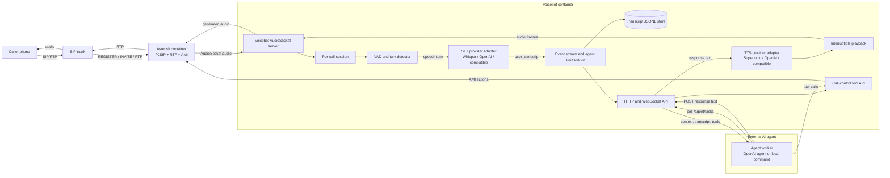

# FlowHunt Voicebot

Prototype SIP voicebot runtime for receiving calls through Asterisk, converting
caller audio to text, sending text events to an external AI agent, and playing
the agent response back into the call.

The first implementation is intentionally modular. The SIP transport, VAD/turn
detection, STT, AI-agent API, TTS, playback, transcripts, and Asterisk control
are separate Python modules so each part can be replaced later.

## How It Works

FlowHunt Voicebot behaves like a SIP phone backed by an event-driven AI runtime.
Asterisk owns the SIP registration, incoming call signaling, RTP media, and
low-level call control. The Python voicebot service receives raw call audio from
Asterisk over AudioSocket, detects caller speech, converts turns to text, emits
events for an external AI agent, accepts asynchronous responses, converts those
responses to speech, and streams the generated audio back into the same call.

The runtime is split into replaceable parts:

- **SIP and media transport**: Asterisk registers to the SIP trunk with PJSIP,
  answers incoming calls, and bridges call audio to the Python service through
  AudioSocket.
- **Call session manager**: `voicebot` creates one isolated session per call.
  Parallel incoming calls are handled as separate sessions with separate event
  queues, playback state, transcripts, and call-control state.
- **Turn detection and barge-in**: VAD watches inbound audio continuously. When
  the caller starts speaking, current bot playback is interrupted so the caller
  can take the turn immediately.
- **STT pipeline**: the configured speech-to-text provider receives completed
  speech turns and returns recognized text. The default local provider is
  Whisper; OpenAI and compatible providers can be selected through environment
  variables.
- **Event queue and transcript store**: every call lifecycle event, speech
  event, transcript, agent request, playback event, tool request, and control
  result is appended to the in-memory event stream and persisted as JSONL under
  the transcript directory.
- **AI agent boundary**: the voicebot core does not contain business logic. It
  exposes pending tasks and tools over HTTP so an external agent can decide what
  to say or what call action to perform.
- **TTS and playback pipeline**: agent text responses are synthesized by the
  configured TTS provider and played back into the SIP call. Playback is
  interruptible whenever the caller starts speaking.
- **Asterisk control tools**: the agent can ask the runtime to hang up,
  transfer the call, send DTMF, stop playback, or read call transcripts through
  HTTP tool endpoints.

## Architecture Schema



## Runtime Flow

1. **Startup**: Docker Compose starts `voicebot`, `asterisk`, and optionally
   `openai-agent`. The voicebot API listens on port `8080` inside Docker and is
   published to the host by `VOICEBOT_API_HOST_PORT`. AudioSocket listens on
   port `9019` inside the Docker network.
2. **SIP registration**: Asterisk builds its PJSIP configuration from
   `asterisk/docker-entrypoint.sh`, registers to the configured SIP trunk, and
   exposes AMI so voicebot can request call-control actions.
3. **Incoming call**: the SIP provider sends an INVITE to Asterisk. Asterisk
   answers and starts an AudioSocket connection to `voicebot:9019`.
4. **Call session creation**: voicebot creates a call session, emits
   `call_started` and `call_connected`, persists both events, and optionally
   creates a greeting task when `VOICEBOT_GREET_ON_CONNECT=true`.
5. **Listening loop**: inbound audio is always read from AudioSocket. VAD emits
   speech-start and speech-finish events. If the bot is speaking when caller
   speech starts, playback is stopped and `bot_playback_interrupted` is emitted.
6. **Transcription**: completed caller speech is sent to the configured STT
   adapter. Successful text becomes a `user_transcript` event and an
   `agent_response_requested` task.
7. **Agent processing**: the external agent polls `/agent/tasks`, receives the
   latest task with compacted call context, decides what to do, and either posts
   text to `/calls/{call_id}/responses` or invokes a tool endpoint.
8. **Speech response**: text responses produce `agent_response_received`,
   `tts_started`, `tts_finished`, and playback events. The generated audio is
   streamed back through AudioSocket into Asterisk and then to the caller.
9. **Tool actions**: agent tool calls emit `call_control_requested`, execute the
   requested Asterisk action through AMI, then emit `call_control_completed`.
10. **Call end**: when the call disconnects, voicebot emits `call_ended`, closes
    the session, and leaves the full transcript available through the transcript
    API.

## Event-Driven Agent Contract

The agent sees the call as an ordered event stream rather than as a blocking
request/response exchange. This is important for real phone calls because user
speech, bot playback, transfers, hangups, DTMF, provider failures, and call end
events can happen independently.

Every event has a `call_id`, `type`, `timestamp`, and `data` object. Agents
should use `agent_response_requested` as the main work item, but they can also
inspect the surrounding events to understand whether the caller interrupted
playback, whether a previous tool call succeeded, or whether the call has
already ended.

When multiple agent workers are running, they should claim tasks before
processing them. Claimed tasks can be renewed or released, and answered task IDs
are retained so the same caller turn is not handled repeatedly.

## Docker SIP Runtime

Create a local environment file or export variables in your shell. Do not commit
real SIP credentials.

```bash
export SIP_PASSWORD='your-password-here'
export VOICEBOT_WHISPER_MODEL=base
export VOICEBOT_LANGUAGE=en
```

Start the stack:

```bash
docker compose up -d --build
```

Services:

- `asterisk`: registers to the SIP trunk and answers incoming calls.
- `voicebot`: receives Asterisk AudioSocket media, runs STT/TTS, stores events,
  and exposes the agent API on `http://127.0.0.1:8080`.
- `openai-agent`: optional online AI agent using the OpenAI Responses API.

Useful checks:

```bash
docker compose ps
docker compose logs -f asterisk
curl http://127.0.0.1:8080/health
```

## Agent API

The voicebot core does not decide what to say. It emits events and waits for an
external AI agent to answer asynchronously.

Read pending user turns:

```bash
curl http://127.0.0.1:8080/agent/tasks
```

Send an answer:

```bash
curl -X POST http://127.0.0.1:8080/calls/CALL_ID/responses \
  -H 'Content-Type: application/json' \
  -d '{"text":"Hello, how can I help you?", "response_to_event_id":123}'
```

Watch events:

```bash
websocat ws://127.0.0.1:8080/ws/events
```

See [AGENTS.md](AGENTS.md) for the full event API, transcripts, context
compaction, local command agent, and call-control endpoints.

## Call Control

The agent can request SIP/Asterisk actions through the API:

- Store and read full call transcripts.
- Observe `call_started`, `user_transcript`, playback, control, DTMF, and
  `call_ended` events.
- Hang up active calls.
- Transfer active calls to another SIP target through Asterisk.

## Local Command Agent

For the first prototype, an external local command can behave as the AI agent:

```bash
python agents/local_command_agent.py \
  --base-url http://127.0.0.1:8080 \
  --command 'codex exec -'
```

The command receives a prompt on stdin and must write only the answer that should
be spoken to the caller.

## OpenAI Provider

The runtime can use OpenAI for the AI agent, STT, and TTS. Put secrets in a
local `.env` file; `.env` is ignored by git.

```bash
SIP_PASSWORD='your-sip-password-here'
OPENAI_API_KEY='your-openai-api-key-here'
VOICEBOT_STT_PROVIDER=openai
VOICEBOT_STT_API_KEY=
VOICEBOT_STT_BASE_URL=
VOICEBOT_STT_MODEL=
VOICEBOT_OPENAI_STT_MODEL=whisper-1
VOICEBOT_TTS_PROVIDER=openai
VOICEBOT_TTS_API_KEY=
VOICEBOT_TTS_BASE_URL=
VOICEBOT_TTS_MODEL=
VOICEBOT_OPENAI_TTS_MODEL=gpt-4o-mini-tts
VOICEBOT_OPENAI_TTS_VOICE=alloy
VOICEBOT_AGENT_TASK_RESPONDED_EVENT_RETENTION=10000
VOICEBOT_AGENT_PROVIDER=openai-responses
VOICEBOT_AGENT_API_KEY=
VOICEBOT_OPENAI_AGENT_MODEL=gpt-4.1-mini
```

Start the full online-provider stack:

```bash
docker compose up -d --build voicebot asterisk openai-agent
```

Docker Compose lets exported shell variables override `.env` values. If you
already have another `OPENAI_API_KEY` exported in the shell, unset it or start
Compose from a clean shell so the project-local `.env` value is used.

OpenAI model names are configurable so the same runtime can switch back to local
Whisper/Supertonic or use newer OpenAI models without code changes.

Provider names:

- STT: `whisper` for local open-source Whisper, `openai` or
  `openai-compatible` for OpenAI or a compatible transcription endpoint via
  `VOICEBOT_STT_BASE_URL`. Aliases `groq`, `mistral`, `nvidia`, and `xai` use
  the same transcription adapter with provider-specific API key env vars and
  default base URLs.
- TTS: `supertonic` for local Supertonic, `openai` or `openai-compatible` for
  OpenAI or a compatible speech endpoint via `VOICEBOT_TTS_BASE_URL`. Aliases
  `groq`, `mistral`, `nvidia`, and `xai` use the same speech adapter with
  provider-specific API key env vars and default base URLs.
- Agent: `openai-responses` for the OpenAI Responses API, or
  `openai-chat-compatible` for chat-completions providers via
  `VOICEBOT_AGENT_OPENAI_BASE_URL`. Provider aliases `azure`, `cerebras`,
  `deepseek`, `fireworks`, `grok`, `groq`, `mistral`, `nebius`, `novita`,
  `nvidia`, `ollama`, `openrouter`, `perplexity`, `qwen`, `sambanova`,
  `sarvam`, `together`, and `xai` map to the same chat-compatible adapter.

The provider registry also recognizes the broader provider names used by modern
voice-agent stacks. If a provider needs a protocol-specific native adapter, the
runtime fails fast with the exact variables to set for an OpenAI-compatible
gateway until that native adapter is added.

## Pipeline Configuration

The STT and TTS call pipelines can be configured with JSON processor specs.
When unset, the defaults preserve the normal flow.

```bash
VOICEBOT_STT_PIPELINE='[{"name":"stt"},{"name":"agent-request"}]'
VOICEBOT_TTS_PIPELINE='[{"name":"tts"}]'
```

Fan-out branches can mirror frames into side pipelines for observers, metrics,
or future integrations:

```bash
VOICEBOT_STT_PIPELINE='[
  {
    "name": "fan-out",
    "options": {
      "branches": [
        {
          "name": "observer",
          "processors": [{"name": "event-log"}]
        }
      ]
    }
  },
  {"name": "stt"},
  {"name": "agent-request"}
]'
```

## Local Microphone Echo Demo

The original local microphone/speaker test script is still available:

```bash
python3 -m venv .venv
source .venv/bin/activate
pip install -r requirements.txt
python listen_transcribe_repeat.py --whisper-model base --language en
```

Use this only for local STT/TTS testing. The SIP voicebot runtime does not repeat
the caller text; it waits for an external agent response.
